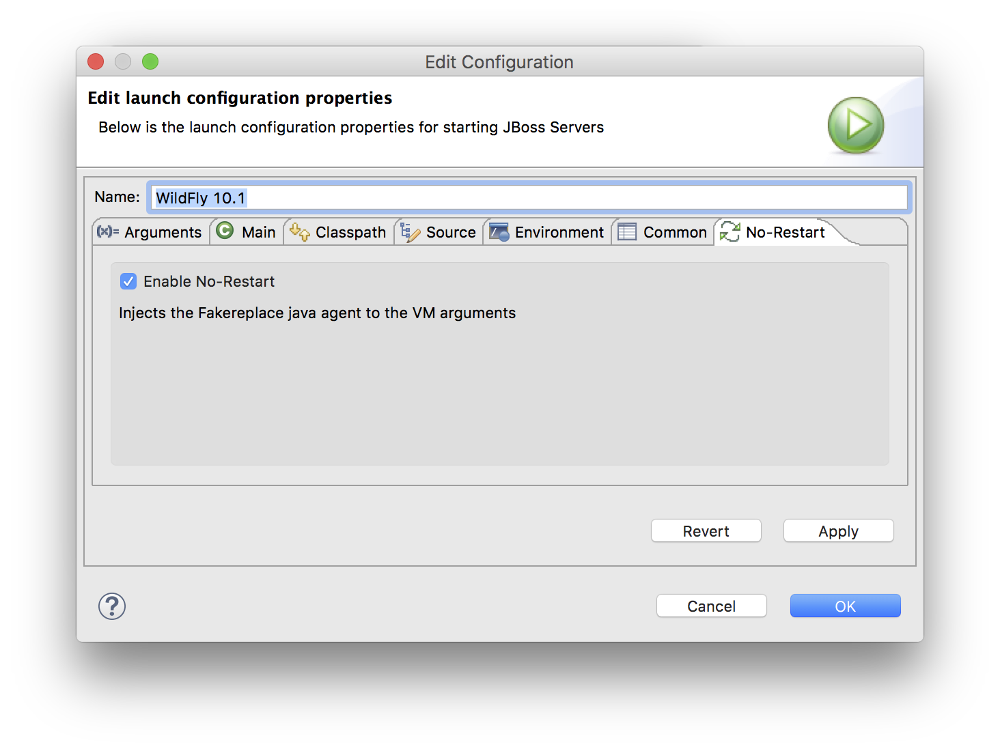

# No-Restart

image:https://travis-ci.org/fbricon/jbosstools-norestart.svg?branch=master["Build Status", link="https://travis-ci.org/fbricon/jbosstools-norestart"]

The No-Restart Eclipse plugin enables https://github.com/fakereplace/fakereplace[fakereplace] in Eclipse's launch configurations, to augment the Hot Code Replacement capabilities of the JVM, without having to restart the Java process. 

It currently supports the following launch configurations:

- [x] Java Applications
- [x] JBoss Servers (from http://tools.jboss.org/[JBoss Tools])
- [x] Eclipse Applications

This experimental plugin can be installed in Eclipse from this p2 repository : https://dl.bintray.com/fbricon/poc/jbosstools-norestart/latest/

